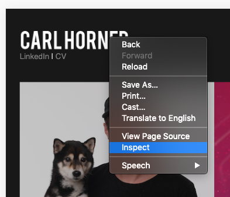
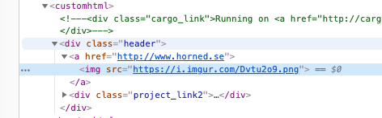
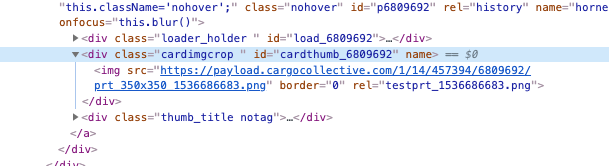
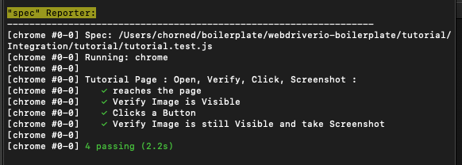

# Your first Test

This tutorial is for you to create your very first locally running webdriverio test. You're not expected to create any files but rather just make modifications where indicated.
This tutorial does not cover docker, browserstack or any other integrations.

## Relevant Files
* webdriverio-boilerplate/package.json
    * This file contains the instructions for different scripts, these scripts execute when you for example run "npm run tutorial:local"
    * This part defines the command you need to run in the terminal: **tutorial:** or **tutorial:local:**
    * This part points at a simple file that just makes sure you have an environment set for you tests: **node_modules/.bin/wdio**
    * This part points at the webdriverio config file where we give all the instructions for our test suite: **test/wdio.conf.local.js --suite dev**
* webdriverio-boilerplate/tutorial/wdio.conf.local.js
    * This file contains the setup instructions for your test. For now we only care about the URL we're running our tests on
* webdriverio-boilerplate/tutorial/Integration/component_objects/TutorialPage.js
    * This file collects all the page components you will want to test. For example buttons you want to click, DIVs you want to make sure are visible etc.
* webdriverio-boilerplate/tutorial/Integration/tutorial/tutorial.test.js
    * This file contains the actual steps and verifications of your test. For example you can verify that a component is visible with isDisplayed (https://webdriver.io/docs/api/element/isDisplayed.html)

## Writing your test

1. Open webdriverio-boilerplate/tutorial/wdio.conf.local.js
2. Change baseUrl to the URL of the page you want to test, for example https://www.horned.se
3. Identify an image you want to confirm is visible on you page
4. Right click the image and select inspect

5. Identify the DIV the image is in and note down it's ID or Class. In this example the Class is "Header"

6. Identify a button you want to click
7. Right click the button and select inspect
8. Identify the DIV the button is in and note down it's ID or Class. In this example the ID is "#cardthumb_6809692"

9. Open webdriverio-boilerplate/tutorial/Integration/component_objects/TutorialPage.js
10. Replace the code in "get Image" to properly identify the ID or Class of the DIV of the image you want to verify
11. Replace the code in "get Button" to properly identify the ID or Class of the DIV of the button you want to click
12. Open webdriverio-boilerplate/tutorial/Integration/tutorial/tutorial.test.js
13. Look at the tests being performed
14. Make Sure there's a step for opening the page
15. Make Sure there's a step for Verifying your image
16. Make sure there's a step for clicking your button
17. Make sure there's a step for Re-Verifying the image and taking a screenshot
18. Open the macOS Terminal or Windows Command Prompt
19. Navigate to the webdriverio-boilerplate root folder
20. Type "npm run tutorial:local"
21. Wait while your tests execute
22. Verify your tests executed succesfully

23. Give yourself a high five

## What to do from here
* Start experimenting with more steps and functions in your tests
* Make as granular tests as possible, don't create one big test for your entire site, but rather keep them small and managable
* Play around! Making mistakes and breaking things is the quickest way to learn
* Start running your tests in Docker
* Start running your tests in Browserstack
